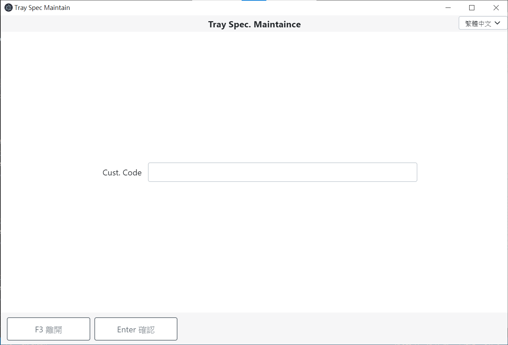
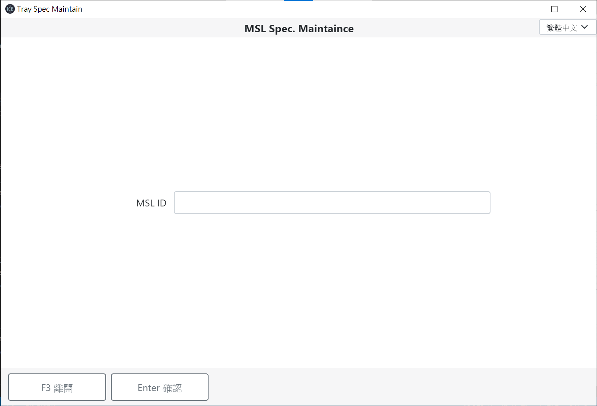
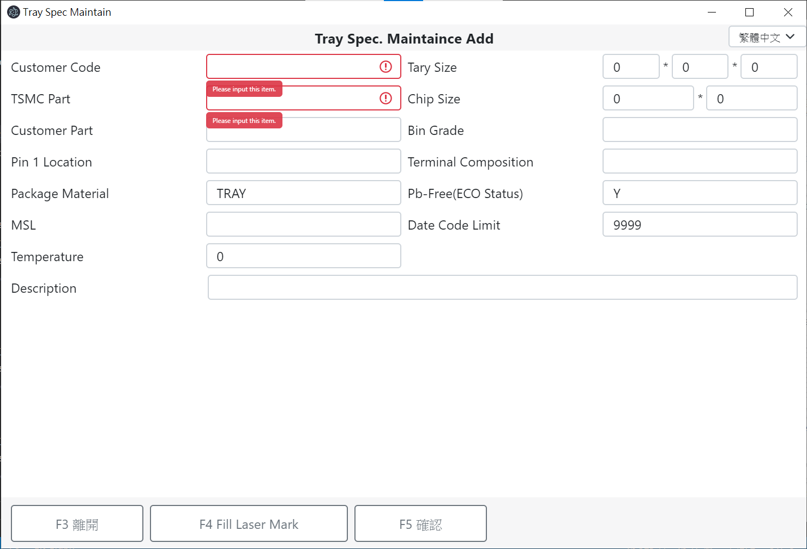
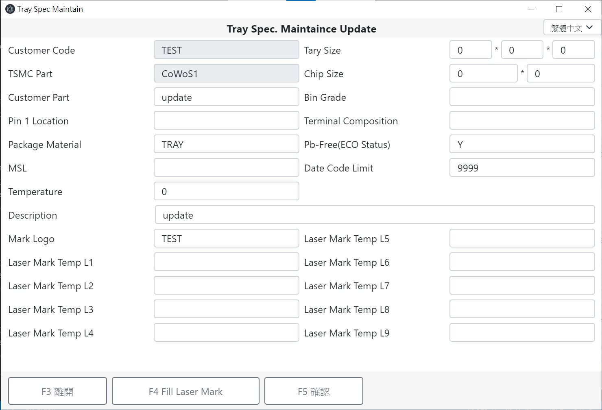

# Tray Spec Maintain
Provide Tray Spec. Maintain GUI using MERN + Electron as Native Web

## Environment
* Node.js  
    Download in TSMC Software Center.  
    Needs to setup Proxy.
* MariaDB  
    Setting database environment at [.env](backend/.env)
    > 目前無法自動create database，未來規劃自動create方式!
    1. Create local database server
        * Download in TSMC Software Center.
        * Download at dockerhub [mariadb](https://hub.docker.com/_/mariadb)
    2. Setting database server, password
        * TSMC  
          defult no password, change it to 'password'  
            * get into **MariaDB Command Prompt**
              ```powershell
              mysqladmin --user=root password "password"
              ```
              if a password has already been previously set  
              ```powershell
              mysqladmin --user=root --password=oldpassword password "newpassword"
              ```
        * dockerhub
          ```powershell
          docker run -p 127.0.0.1:3306:3306 --name mariadb -e MARIADB_ROOT_PASSWORD=password -d mariadb
          ```
    3. Get into MySQL Client
        * TSMC  
          get into **MariaDB MySQL Client**
        * docker
            ```powershell
            docker exec -it mariadb bash
            mysql -u root -p
            ```
    4. Create database
        ```powershell
        CREATE DATABASE TRAY_MAINTAIN;
        SHOW DATABASES;
        ```

## Code
download zip or clone
```powershell
git clone https://github.com/yurutung/OMI-Tray_Spec_Maintain.git
```

## Install & Usage
1. build frontend
    ```powershell
    cd frontend
    npm install
    npm run build
    ```
2. run backend
    ```powershell
    cd backend
    npm install
    npm run build
    npm start
    ```
    Can setting server port at [.env](backend/.env) -`FASTIFY_PORT`
3. run electron  
    Run if you want to use electron app  
    * In TSMC enviroment, **should install in NB, move to 開發機, then run start in another terminal**
    * should setting .env, connect to your backend url
    ```powershell
    cd electron
    npm install
    npm start
    ```
Web Url: http://localhost:[PORT] (http://localhost:8888)

## Project Introduction
提供客戶設定出貨時所需要的Tray的規格，使用Web方式重建新的系統。

### Home
Home page 可選擇搜尋 Tray Spec or Msl，click後進入 Search page

可使用shortcut(F1、F2)選擇搜尋項目

### Search
Tray Spec 透過 Custumer Code 搜尋 data


Msl 透過 Msl id 搜尋 data


皆可使用 * 作為萬用字元，搜尋後顯示在 Data page

### Data

#### Get Data
Search 後顯示 data table

data過多會增加scroll bar，設定table不自動換行

#### Add Data
click 新增(F1)可新增資料

* 若Customer Code、TSMC Part未填寫，則顯示出該項目未填寫且無法送出


* 若TSMC Part為CoWoS Part，則自動展開Laser Mark，且必填其中一欄
* 若TSMC Part不為CoWoS Part，亦可透過click Fill Laser Mark(F4) 填寫，但不為必填

click確認後，會新增至DB
* 新增成功，跳出alert通知，並回到Data page
* 新增失敗，跳出alert通知，並停留在Add page

#### Update Data
選擇欲更新的row，並 click 更新(F2) 可更新該筆資料

* 將data自動帶入輸入框，pk欄位無法更新
* 若Laser Mark部分有填寫，則會自動展開


* 送出時，若為CoWoS Part，但Laser Mark未填寫，則無法送出
* 送出時，若不為CoWoS Part，且Laser Mark皆未填寫，則刪除該筆資料

#### Delete Data
選擇欲刪除的row，並 click 刪除(F4) 可刪除該筆資料

* 刪除前需點擊確認刪除，避免操作錯誤無法復原資料
* 若點擊刪除時未選擇欲刪除資料，則顯示請選擇刪除資料
* 刪除成功則顯示成功資訊

#### Export Data
click 儲存檔案(F5) 可匯出表格資料


* 輸出格式為csv
* 欄位名稱為DB內名稱

#### Upload Data
click 讀取檔案(F6) 可上傳檔案並一次新增或更新多筆資料
* 輸入格式與儲存檔案之格式相同

上傳之後會顯示preview page

* 可直接於預覽頁面點擊欲編輯欄位進行編輯
* 若必填欄位未填寫會以紅色背景提示，且無法送出
* 可選擇row，點擊刪除後則該欄不上傳至資料庫

### Multiple language setting
目前可切換繁體中文、英文


## Project Structure
透過MERN完成Web架設，Electron直接連接Web的網址，以達成Web及App並行使用。


```
OMI-Tray_Spec_Maintain
├─ backend
│  ├─ .env
│  ├─ jest.config.js
│  ├─ package-lock.json
│  ├─ package.json
│  ├─ src
│  │  ├─ index.ts                  ----- entry point  
│  │  ├─ models                    ----- database models
│  │  │  ├─ index.ts
│  │  │  ├─ tray_lsr_mrk.ts
│  │  │  ├─ tray_msl.ts
│  │  │  └─ tray_spec.ts
│  │  ├─ plugins                   ----- database connection 
│  │  │  └─ mariadb.ts
│  │  ├─ repo                      ----- CRUD to database repository
│  │  │  ├─ tray_lsr_mrk-repo.ts
│  │  │  ├─ tray_msl-repo.ts
│  │  │  └─ tray_spec-repo.ts
│  │  ├─ server.ts                 ----- fastify server
│  │  ├─ test                      ----- unit test
│  │  │  ├─ tray_lsr_mrk.spec.ts
│  │  │  ├─ tray_msl.spec.ts
│  │  │  └─ tray_spec.spec.ts
│  │  └─ types                     ----- type definition
│  │     ├─ tray_lsr_mrk.ts
│  │     ├─ tray_msl.ts
│  │     └─ tray_spec.ts
│  └─ tsconfig.json
├─ electron
│  ├─ .env
│  ├─ main.js                      ----- electron entry point
│  ├─ package-lock.json
│  └─ package.json
├─ frontend
│  ├─ package-lock.json
│  ├─ package.json
│  ├─ public
│  │  ├─ favicon.ico
│  │  ├─ index.html
│  │  ├─ logo192.png
│  │  ├─ logo512.png
│  │  ├─ manifest.json
│  │  └─ robots.txt
│  ├─ src
│  │  ├─ api                       ----- call backend api
│  │  │  ├─ tray_lsr_mrk.ts
│  │  │  ├─ tray_msl.ts
│  │  │  └─ tray_spec.ts
│  │  ├─ App.tsx                   ----- react renderer entry point
│  │  ├─ asset
│  │  │  ├─ css
│  │  │  │  ├─ App.css
│  │  │  │  ├─ bootstrap.css
│  │  │  │  └─ index.css
│  │  │  └─ i18n
│  │  │     ├─ en.json
│  │  │     └─ zh-TW.json
│  │  ├─ components                ----- components
│  │  │  ├─ AddTrayLsrMrk.tsx
│  │  │  ├─ AddTrayMsl.tsx
│  │  │  ├─ AddTraySpec.tsx
│  │  │  ├─ Datas.tsx
│  │  │  ├─ Home.tsx
│  │  │  ├─ Search.tsx
│  │  │  ├─ TrayMslTable.tsx
│  │  │  ├─ TraySpecTable.tsx
│  │  │  └─ UploadPreview.tsx
│  │  ├─ functions.tsx
│  │  ├─ i18n.ts                   ----- multiple language setting
│  │  ├─ index.tsx                 ----- entry point
│  │  ├─ logo.svg
│  │  ├─ react-app-env.d.ts
│  │  ├─ reportWebVitals.ts
│  │  ├─ setupTests.ts 
│  │  ├─ test
│  │  │  └─ App.test.tsx
│  │  └─ type.d.ts                 ----- type definition
│  └─ tsconfig.json
└─ README.md
```

### Use Case
User can operate Tray Spec、Msl Spec  


### Backend
API Document: [Project URL]/documnetation (http://localhost:8888/documnetation)
* 可直接於此document測試API，顯示回傳內容


#### Package
* [sequelize-typescript](https://www.npmjs.com/package/sequelize-typescript)  
    a promise-based Node.js ORM tool for Postgres, MySQL, **MariaDB**, SQLite and Microsoft SQL Server.  
    ```powershell
    npm install mariadb reflect-metadata sequelize sequelize-typescript
    npm install -D @types/node @types/validator
    ```
    * setting  
        [tsconfig.json](backend/tsconfig.json)
        ```json
        "target": "es6", // or a more recent ecmascript version
        "experimentalDecorators": true,
        "emitDecoratorMetadata": true
        ```
    * Database connection
        [mariadb.ts](backend/pligins/mariadb.ts)
        ```typescript
        public static async establishConnection() {
          // connection
          this.sequelize = new Sequelize(`mariadb://${user}:${password}@${host}:${port}/${database}`)
          // add models
          await this.sequelize.addModels(Object.values(models))
          // if table does not exist, then create table
          await this.sequelize.sync()
          // check connection
          await this.sequelize.authenticate()
            .then(async () => console.log('Connection has been established successfully.'))
            .catch(err => console.error('Unable to connect to the database:', err))
        }
        ```
        * Automatic create database table
            * if table does not exist, then create table
              ```typescript
              sequelize.sync()
              ```
            * delete, then create new table
              ```typescript
              sequelize.sync({ force: true )
              ```
            * checks what is the current state of the table in the database, then performs the necessary changes in the table to make it match the model
              ```typescript
              sequelize.sync({ alter: true })
              ```
    * Setting [transaction](https://sequelize.org/master/manual/transactions.html)
        ```typescript
        import { DBConnection } from './plugins/mariadb'
        ...
        // function
        const t = await DBConnection.getSequelize().transaction()
        try {
          await traySpec.create(traySpecBody, { transaction: t })
          await trayLsrMrk.create(trayLsrMrkBody, { transaction: t })
          ...
          await t.commit()
        } catch (error) {
          await t.rollback()
        }
        ```
* [sequelize-typescript-generator](https://www.npmjs.com/package/sequelize-typescript-generator)  
    自動抓取DB，生成sequelize-typescript所需的定義檔案
    ```powershell
    npm i -D sequelize-typescript-generator
    npx stg -D mariadb -h localhost -p 3306 -d TRAY_MAINTAIN -u root -x password --indices --case camel --out-dir ./models --clean
    ```
* [fastify-swagger](https://www.npmjs.com/package/fastify-swagger): [DOC](https://swagger.io/docs/)  
    easy to set api document, can try api by web UI  
    [server.ts](backend/src/server.ts)
    ```typescript
    import fastifySwagger from 'fastify-swagger'
    ...
    server.register(fastifySwagger, {
        mode: 'static',
        routePrefix: '/documentation',
        exposeRoute: true,
        specification: {
            path: 'docs/swagger.yaml',
            postProcessor: (_) => _,
            baseDir: ''
        }
    })
    ```
    add [docs/swagger.yaml](backend/docs/swagger.yaml)
    ```yaml
    openapi: "3.0.2"
    info:
      title: API spec of Tray Spec Maintain
      version: "1.0"
      description: API spec of Tray Spec Maintain for handling data transfer between frontend and backend
    servers:
      - url: http://localhost:8888/api
        description: API endpoint of backend
    paths:
      /tray_spec:
        post:
          tags:
            - Tray Spec
          summary: Post new tray spec
          description: Post a new tray spec
          requestBody:
            required: true
            content:
              applicationapplication/json:
                schema:
                  $ref: "#/components/schemas/tray_spec"
          responses:
            "201":
              description: Successfully post a new tray spec
              content:
                application/json:
                  schema:
                    type: object
                    properties:
                      traySpec:
                        $ref: "#/components/schemas/tray_spec"

    components:
      schemas:
        tray_spec:
          type: object
          properties:
            CUST_CD:
              type: string
              required: ture
              description: Customer Code
            PRODSPEC_ID:
              type: string
              required: ture
              description: TSMC Part
            CUST_PART_ID:
              type: string
              description: Customer Part
              ...
    ```

### Frontend
Component Diagram


#### Package
* [react bootstrap table](https://www.npmjs.com/package/react-bootstrap-table-next)  
    easy to create table  
    * 規定需要一個欄位當keyField
    ```typescript
    import BootstrapTable, { SelectRowProps } from "react-bootstrap-table-next"

    const columns = [
        {
          dataField: "msl",
          text: "MSL ID",
          sort: true,
        },
        {
          dataField: "floorLife",
          text: "Floor Life",
          sort: true,
        },
    ]
    const selectRow: SelectRowProps<any> = {
        mode: 'radio',
        clickToSelect: true,
        style: { backgroundColor: '#c8e6c9' },
        onSelect: handleOnSelect,
    }

    return (
        <BootstrapTable keyField="msl" data={datas} columns={columns} selectRow={selectRow} />
    )
    ```
* [react-shortcut](https://www.npmjs.com/package/react-shortcut)  
    easy to setup shortcut
    ```typescript
    import ReactShortcut from 'react-shortcut'
    ...
    <ReactShortcut
        keys={'f1'}
        onKeysPressed={() => { document.getElementById('tray_spec').click() }}
    />
    ```
* [sweetalert2](https://www.npmjs.com/package/sweetalert2): [DOC](https://sweetalert2.github.io/)  
    easy to have a pretty alert
    * 定義toast alert格式
        ```typescript
        const toastMixin = Swal.mixin({
            toast: true,
            icon: 'success', //error, info
            title: 'General Title',
            position: 'top-right',
            showConfirmButton: false,
            timer: 3000,
            timerProgressBar: true,
            didOpen: (toast) => {
                toast.addEventListener('mouseenter', Swal.stopTimer)
                toast.addEventListener('mouseleave', Swal.resumeTimer)
            }
        })
        ```
    * 使用alert
        ```typescript
        toastMixin.fire({
            title: 'Add data Successfully!'
        })
        ```
* [react-csv-downloader](https://www.npmjs.com/package/react-csv-downloader)  
    easy to change json to csv format, then download
    ```typescript
    import CsvDownloader from 'react-csv-downloader'
    <CsvDownloader datas={data} filename={`exportData.csv`}></CsvDownloader>
    ```
* [csvtojson](https://www.npmjs.com/package/csvtojson)  
    change csv format to json, easy to input data to DB
    ```typescript
    const reader = new FileReader()
    reader.onloadend = (e) => {
        const csvData: string = reader.result?.toString() || ''
        csv().fromString(csvData).then(o => console.log(o))
    }
    reader.readAsText(file)
    ```
* [react-hook-form](https://react-hook-form.com/)  
    easy to validation
    ```typescript
    import { useForm } from "react-hook-form"
    const { register, watch, handleSubmit, formState: { errors } } = useForm<ITraySpec>({ mode: 'all', defaultValues: initData() })
    ...
    <form className="needs-validation" onSubmit={handleSubmit(saveTraySpec, checkLsrMrk)}>
        <input type="number" {...register('CUST_CD', { required: true, maxLength: 64 })} />
    </form>
    ```
* [react-i18next](https://react.i18next.com/)  
    set mulitiple language, and east to change language  
    add [i18n.ts](frontend/src/i18n.ts)
    ```typescript
    import i18n from 'i18next'
    import { initReactI18next } from 'react-i18next'
    import en from './asset/i18n/en.json'
    import tw from './asset/i18n/zh-TW.json'

    const resources = {
      en: {
        translation: en,
      },
      'zh-TW': {
        translation: tw,
      },
    }

    i18n.use(initReactI18next).init({
      resources,
      lng: 'zh-TW',             //預設語言
      fallbackLng: 'zh-TW',     //如果當前切換的語言沒有對應的翻譯則使用這個語言，
      interpolation: {
        escapeValue: false,
      },
    })

    export default i18n
    ```
    update [App.tsx](frontend/src/App.tsx)
    ```typescript
    import './i18n'
    import { useTranslation } from "react-i18next"
    const { t } = useTranslation()
    ...
    <div>{t('button.back')</div>
    ```


### Electron

#### Environment & Install
公司環境開發機無法直接install，僅能用NB install後再傳到開發機  
* 公司環境透過npm install只能下載到版本5.0.3，較新版本(目前最新版本為13.1.8)整個環境下載下來執行也會有Error，不太確定原因為何
* 新舊版差異
    * 目前發現的差異為CSS的部分，舊版的不支援gap

#### Usage
##### iframe
架設基礎electron即可，透過網址連接已架好的web
* 目前使用這種方式

##### build a app
相關參考
* 我之前的[半成品](https://github.com/yurutung/Tray_Spec_Maintain)
* [Electron forge](https://www.electronforge.io/)
    * Electron create、build、package tool
    * 公司環境無法install，整個環境在公司電腦也無法執行，不確定原因為何
* [electron-typescript-react](https://github.com/diego3g/electron-typescript-react)
    * Electron, React and Typescript template
    * 公司環境無法install

build exe 方式
* [electron-packager](https://www.npmjs.com/package/electron-packager)
    ```
    npm run package
    ```
    * 可於`package.json`中更改參數
* [electron-builder](https://www.npmjs.com/package/electron-builder)
    * 公司環境無法使用，但網路上大多推薦這個方式

可能遇到問題 & 解決方式
* 是否顯示menu bar
    * 更改`main.js`中，`autoHideMenuBar: true`
* 渲染時抓不到css
    * 使用[css-loader](https://www.npmjs.com/package/css-loader)、[style-loader](https://www.npmjs.com/package/style-loader)
        ```powershell
            npm install bootstrap react-bootstrap-table-next
            npm install -D css-loader style-loader @types/react-bootstrap-table-next
        ```
        * setting
            rules.webpack.js
            ```javascript
            {
                test: /\.css$/,
                use: ['style-loader', 'css-loader']
            }
            ```
            index.tsx
            ```typescript
            // css
            import 'react-bootstrap-table-next/dist/react-bootstrap-table2.min.css'
            import 'bootstrap/dist/css/bootstrap.min.css'
            ```
* get Database data by ipcMain, ipcRenderer
    * package.json 設定 preload js
        ```json
        "entryPoints": [
            {
              "html": "./public/index.html",
              "js": "./src/index.tsx",
              "name": "main_window",
              "preload": {
                "js": "./electron/bridge.ts"
              }
            }
        ]
        ```
    * 前端頁面透過`window.Main.FUNC_NAME()`呼叫 bridge.ts 內function
    * bridge.ts 加入function，透過ipcRenderer連接 main.ts 內的ipcMain
        ```typescript
        getData: async (mode: string, id: string): Promise<[]> => {
            const res = await ipcRenderer.sendSync('getData', mode, id)
            if (res.status == 200) {
              return res.data
            }
            else {
              throw new Error(res.data)
            }
        },
        ```
    * main.ts 呼叫DB service
        ```typescript
        ipcMain.on('getData', async (_, mode, id) => {
            try {
              _.returnValue = {
                  status: 200,
                  data: await tsService.getDatas(id)
                }
            } catch (error) {
              console.error(`getData/${mode}/${id} Error: ${error}`)
              _.returnValue = {
                status: 500,
                data: `getData/${mode}/${id} Error: ${error}`
              }
            }
          })
        ```
    * ipcMain catch error之後直接throw error會有`UnhandlePromise`的error，不知道怎麼解決，所以先用status code判斷
* 透過網址切換畫面，且可傳送Object data
    * [react-router-dom](https://www.npmjs.com/package/react-router-dom)實作出利用網址切換頁面
    * Electron無法使用BrowserRouter，HashRouter無法使用state傳遞參數，故使用MemoryRouter
        App.tsx
        ```typescript
        import { MemoryRouter, Route, Redirect } from "react-router-dom"

        <MemoryRouter>
            <Route path="/" exact component={Home} />
            <Route path="/search/:mode" component={Search} />
            <Route path="/datas/:mode/:id" component={Datas} />
            <Route path="/add/tray_spec/:id" component={AddTraySpec} />
            <Route path="/add/tray_msl/:id" component={AddTrayMsl} />
            <Route render={() => <Redirect to="/" />} />
        </MemoryRouter>
        ```
        * exact: 需為全符合
        
        使用`location.state`來得到selected row
        ```typescript
        import { useHistory } from "react-router-dom"
        const history = useHistory()
        history.push(
            `/add/tray_msl/${id}`,
            {
              isEdit: true,
              selectedData: selected
            }
        )
        ```